# 🛡️ AWS IAM User Management System

> A hands-on AWS project to create and manage IAM users, groups, roles, policies, and MFA — all following best security practices.

---

## 📘 Project Summary

In this project, I created and managed IAM users, groups, roles, and policies in AWS to implement secure access control. I also enabled MFA (Multi-Factor Authentication) to increase account security.

---

## ✅ Step-by-Step Process

### 🔸 Step 1: Open IAM Management Console

- Go to AWS Console → Search IAM → Open IAM Dashboard

<p align="center">
  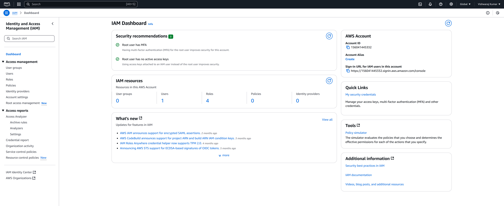
  <br>
  <em>Figure: IAM Management Console</em>
</p>

---

### 🔸 Step 2: Create a New User

I created a new IAM user for a team member.
- IAM Dashboard → Click **Users** (left sidebar)
- Click "**Create Users**"
- Enter a **User Name** (e.g., D eveloper1 )
- **Select access type** :
  - ✅ Provide user access to the AWS Management Console 
  - ✅ I want to create an IAM user
- Set a **password** and choose:
  - User must create a new password on first sign-in

<p align="center">
  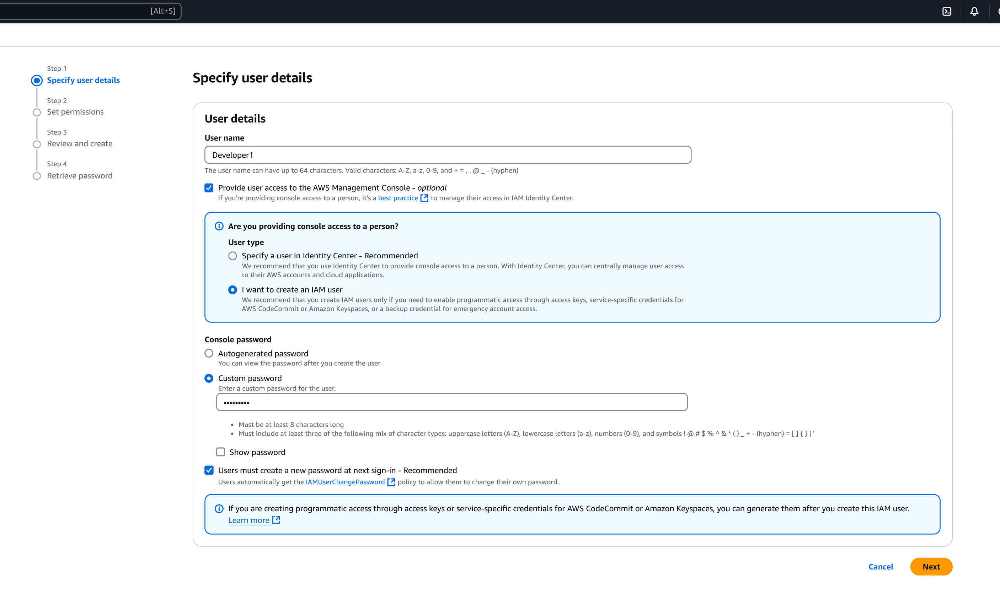
  <br>
  <em>Figure: IAM user create</em>
</p>

---

### 🔸 Step 3: Create and Assign User to a Group

Instead of giving permissions directly, I created a group and attached a policy to it.
- On the same "Add user" flow → Click "**Create group**"
- Give a group name (e.g., DevelopersGroup )
- Attach a permission policy (e.g., **AmazonS3ReadOnlyAccess** )
- Add the user to this group

<p align="center">
  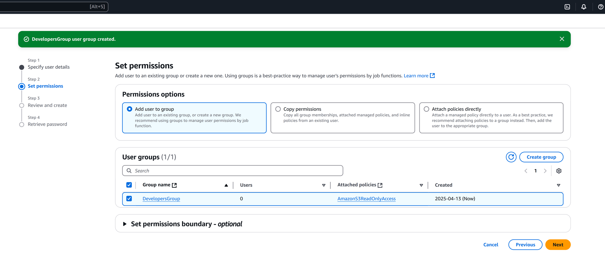
  <br>
  <em>Figure: Add the user to this group</em>
</p>

---

### 🔸 Step 4: Review and Create User

- Review user details
- Click **Create User**
- Download or copy the user’s **login credentials**

<p align="center">
  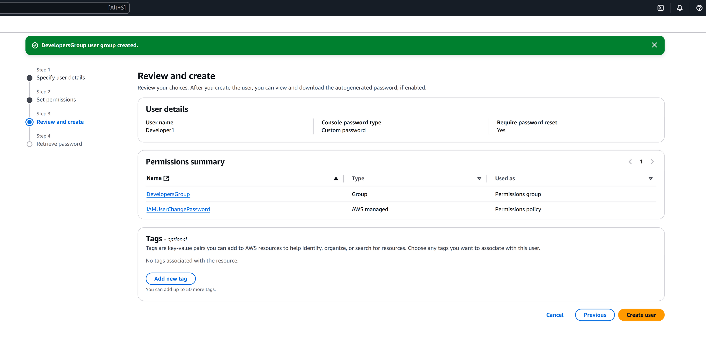
  <br>
  <em>Figure: Review and create user</em>
</p>

---

### 🔸 Step 5: Configure IAM Roles

IAM Roles allow services to access resources securely.
I created a role for EC2 to access S3.
- IAM Dashboard → **Roles** → Click **Create role**
- Select **AWS service** → Choose **EC2**
- Click **Next**
- Attach permission policy: **AmazonS3ReadOnlyAccess**
- Give role name: EC2_S3_AccessRole

<p align="center">
  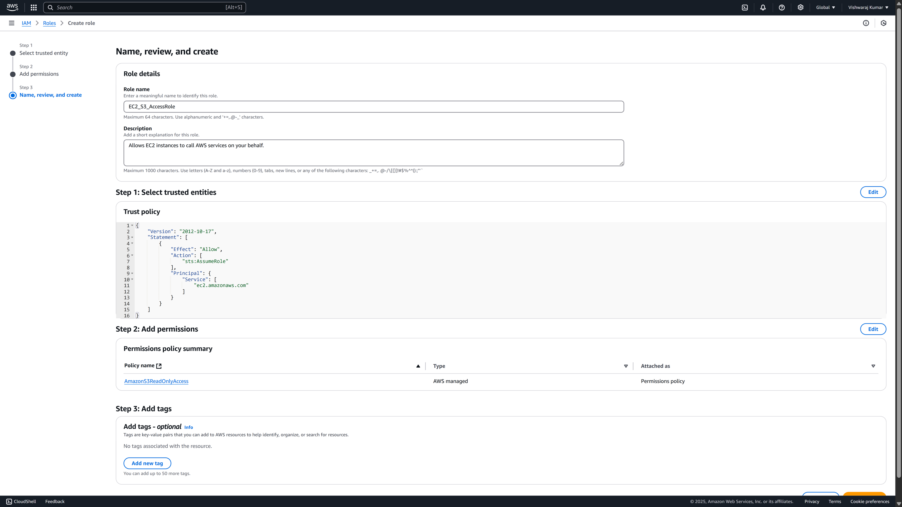
</p>

---

### 🔸 Step 6: Attach Role to EC2 Instance

If using EC2 in your project:
- Go to EC2 → Instances → Select instance
- Actions → Security → Modify IAM Role
- Attach EC2_S3_AccessRole

<p align="center">
  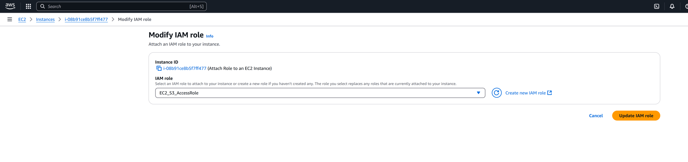
  <br>
  <em>Figure: Modify IAM Role</em>
</p>

---

### 🔸 Step 7: Set Up MFA (Multi-Factor Authentication)

To secure my IAM user login, I enabled MFA.
- IAM → Users → Select the user → **Security credentials** tab
- Under **Assigned MFA device** → Click "**Manage**"
- Choose **Virtual MFA device**
- Scan QR using Google Authenticator / Authy
- Enter two consecutive codes shown in the app

<p align="center">
  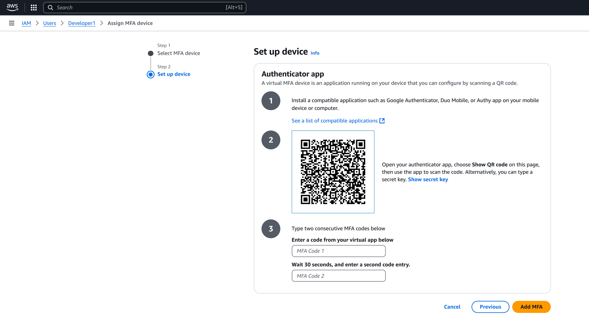
  <br>
  <em>Figure: Set up device</em>
</p>

<p align="center">
  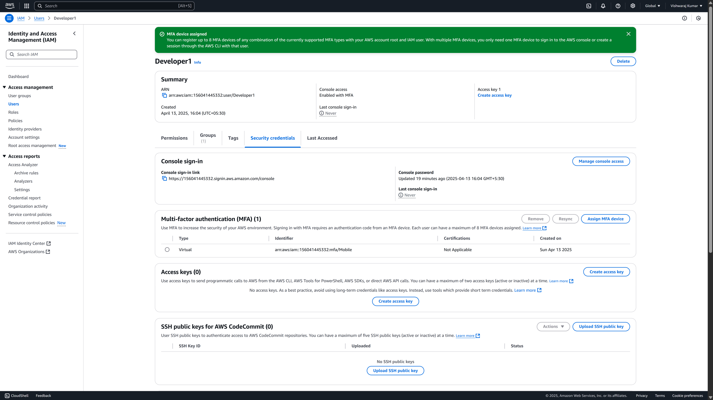
  <br>
  <em>Figure: MFA device assigned</em>
</p>

---

### 🔸 Step 8: Create a Custom Policy (Optional but Usefull)

To give more precise access, I created a custom policy.
- IAM → Policies → Create policy
- Choose JSON tab and paste your policy.
  - Example: Allow full access to a specific S3 bucket.

```json
{
  "Version": "2012-10-17",
  "Statement": [
    {
      "Effect": "Allow",
      "Action": "s3:*",
      "Resource": "arn:aws:s3:::my-bucket-name/*"
    }
  ]
}
```

📄 **View Full Policy Example:**  
Check out the complete custom S3 bucket policy with explanation and usage steps in this file:  
👉 [policy-examples](Policy-Examples/CustomS3BucketAccess.md)

<p align="center">
  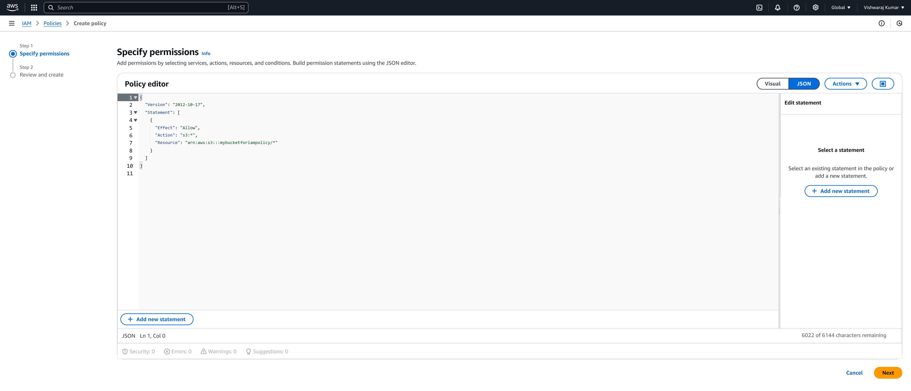
  <br>
  <em>Figure: Create policy via policy editor</em>
</p>

- Review → Name it: CustomS3BucketAccess
- Attach this policy to a group or user

<p align="center">
  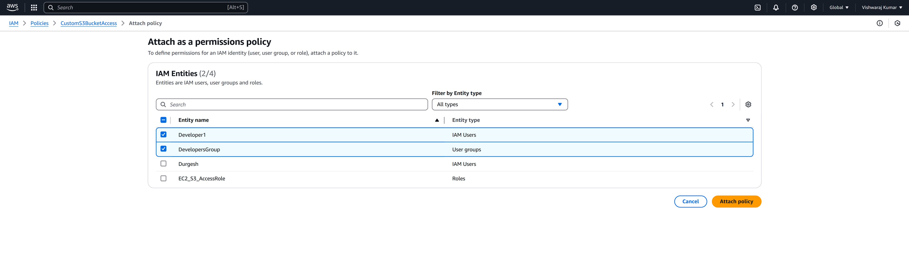
  <br>
  <em>Figure: Attach this policy to a group or user</em>
</p>

---

### 🔸 Step 9: Test the IAM User Login

I tested my new user by logging in from the AWS Console link.
- Use the **console login URL** from step 4
- Login with user credentials
- Test access to S3 or EC2 (based on attached policies)
- Check that user has only what is allowed by the policy

<p align="center">
  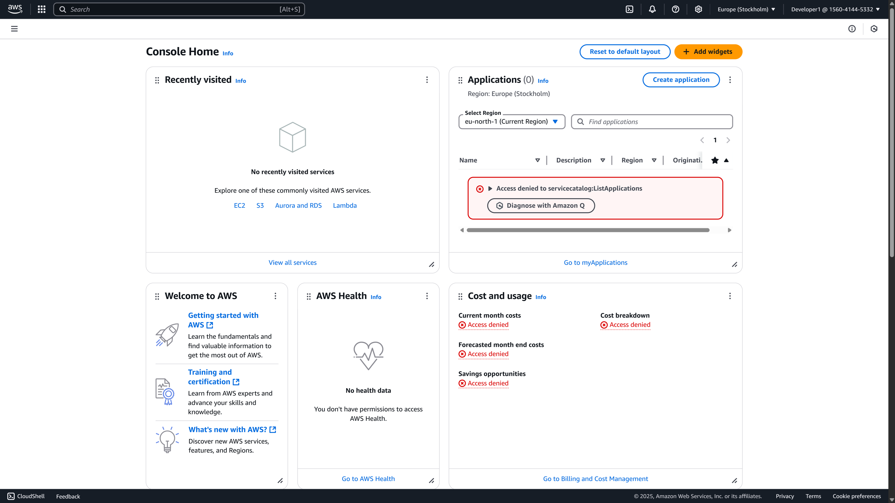
  <br>
  <em>Figure: Login with user credentials</em>
</p>

---

## 🎯 Project Achievements:

- ✔️ Followed principle of least privilege
- ✔️ Created secure user and group structure
- ✔️ Used roles to grant access between services
- ✔️ Enabled MFA to protect user accounts
- ✔️ Implemented custom policies for specific access needs

---

## 📌 Conclusion

This IAM User Management System helped me understand how to build a secure identity system in AWS. IAM is very powerful, and following best practices like group-based permissions, least privilege, and MFA is essential for cloud security.

---

## ✍️ Author

**Vishwaraj Kumar**  
🔗 [GitHub Profile](https://github.com/vishwaraj-kumar)  
🔗 [LinkedIn Profile](https://www.linkedin.com/in/vishwaraj-kumar/)
